Internal codename: **Tengu**. Runtime: Bun. UI: React Ink. Language: TypeScript.

---

## 1. System Overview

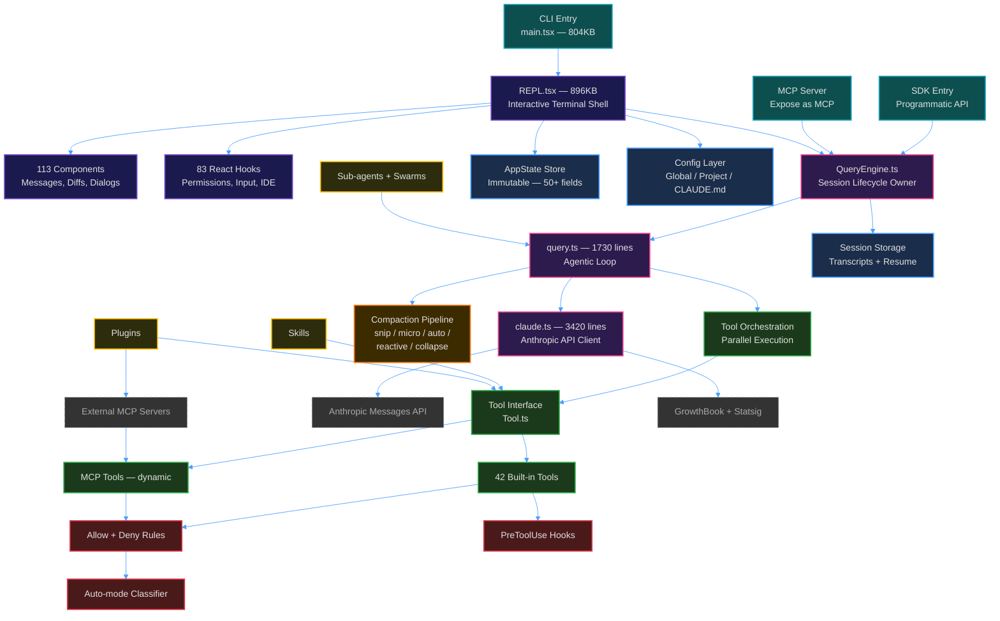

---

## 2. Core Engine — The Agentic Loop

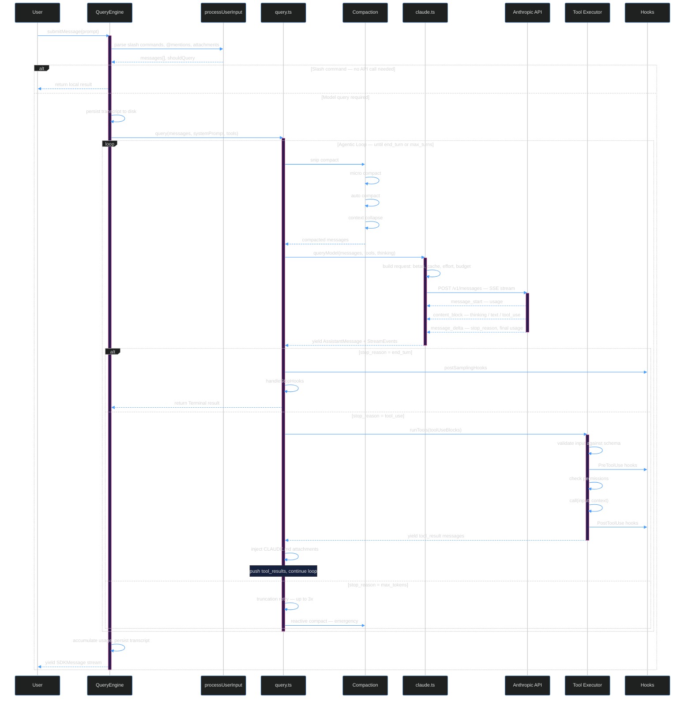

---

## 3. Tool System

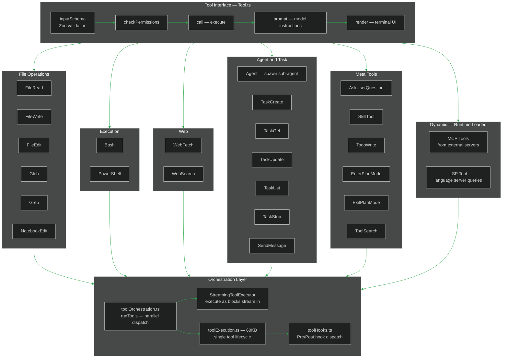

---

## 4. Permission System

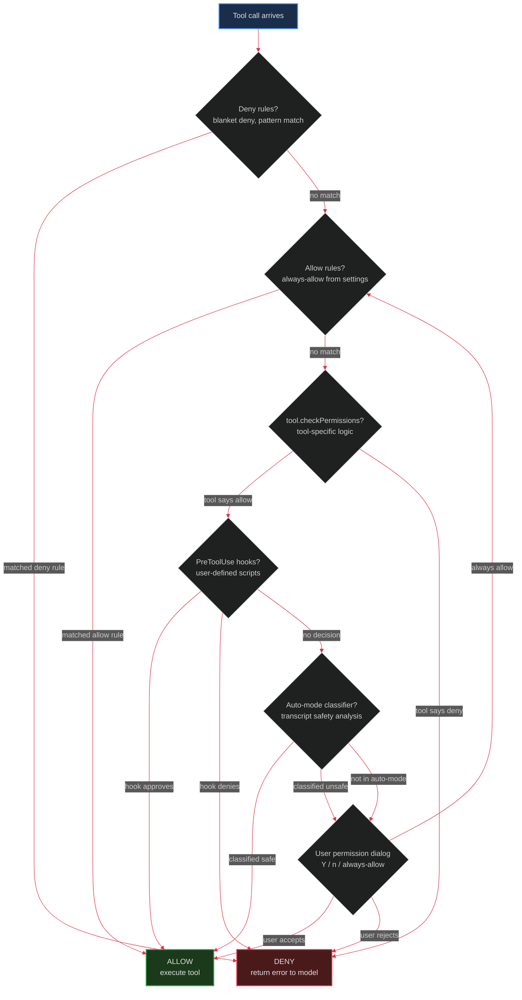

### Permission Modes

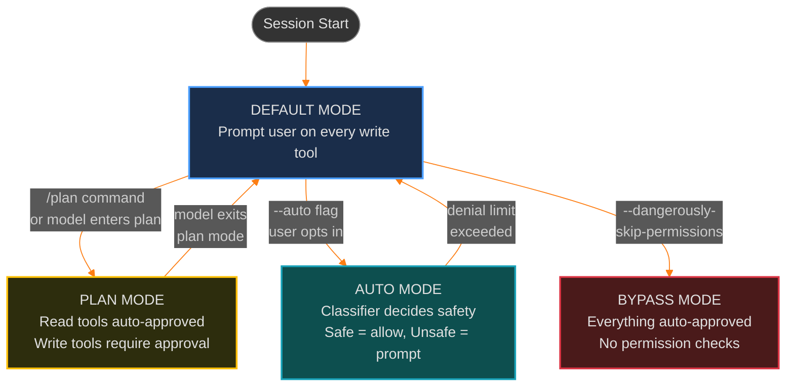

---

## 5. Context Management — Compaction Pipeline

```mermaid
%%{init: {'theme': 'dark', 'themeVariables': { 'primaryColor': '#1a1a2e', 'primaryTextColor': '#e0e0e0', 'lineColor': '#fd7e14', 'primaryBorderColor': '#fd7e14'}}}%%
flowchart LR
    RAW["Raw message<br/>history"]:::input

    S1["SNIP COMPACT<br/>Sliding window<br/>Drop oldest turns<br/>Preserve recent N"]:::stage1
    S2["MICRO COMPACT<br/>Truncate individual<br/>tool results exceeding<br/>size thresholds"]:::stage2
    S3["AUTO COMPACT<br/>Summarize full conversation<br/>via separate API call<br/>Circuit breaker on failure"]:::stage3
    S4["CONTEXT COLLAPSE<br/>Read-time projection<br/>Archived collapsed views<br/>Granular preservation"]:::stage4

    FINAL["Messages ready<br/>for API call"]:::output

    S5["REACTIVE COMPACT<br/>Emergency trigger<br/>on API 413 error<br/>Last resort"]:::emergency

    RAW ==> S1 ==> S2 ==> S3 ==> S4 ==> FINAL
    FINAL -. "API returns prompt_too_long" .-> S5
    S5 ==> FINAL

    classDef input fill:#1a2d4a,stroke:#4a9eff,color:#e0e0e0,stroke-width:2px
    classDef stage1 fill:#0d3d0d,stroke:#28a745,color:#e0e0e0,stroke-width:2px
    classDef stage2 fill:#0d4f4f,stroke:#17a2b8,color:#e0e0e0,stroke-width:2px
    classDef stage3 fill:#2d2d0d,stroke:#ffc107,color:#e0e0e0,stroke-width:2px
    classDef stage4 fill:#2d1b4e,stroke:#6f42c1,color:#e0e0e0,stroke-width:2px
    classDef output fill:#1a2d4a,stroke:#4a9eff,color:#e0e0e0,stroke-width:2px
    classDef emergency fill:#4a1a1a,stroke:#dc3545,color:#e0e0e0,stroke-width:2px
```

### Token Budget State Machine

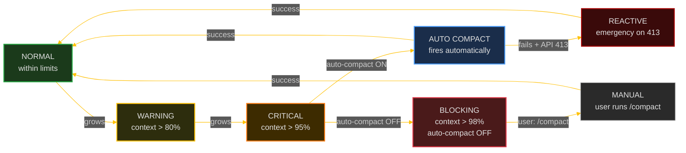

---

## 6. Data Flow — User Input to Response

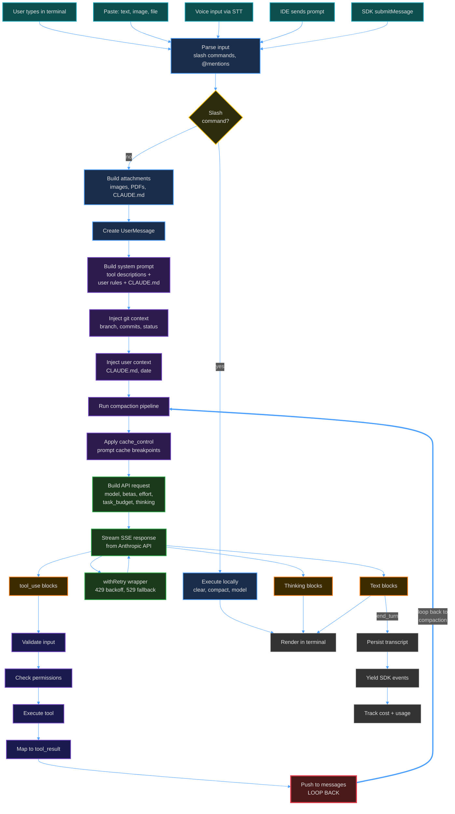

---

## 7. State Management

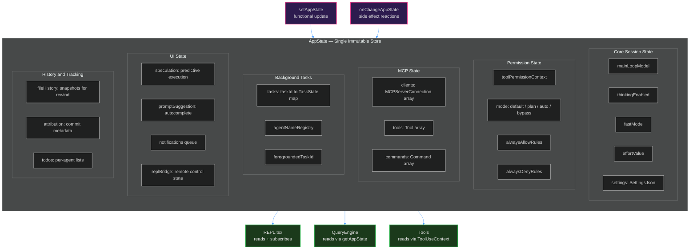

---

## 8. Extension Model

```mermaid
%%{init: {'theme': 'dark', 'themeVariables': { 'primaryColor': '#1a1a2e', 'primaryTextColor': '#e0e0e0', 'lineColor': '#ffc107', 'primaryBorderColor': '#ffc107'}}}%%
graph TB
    subgraph Skills["Skills"]
        BS["Bundled Skills<br/>shipped with CLI"]:::skill
        US["User Skills<br/>.claude/skills/*.md"]:::skill
        PS["Project Skills<br/>.claude/skills/ in repo"]:::skill
        SL["loadSkillsDir.ts<br/>discover + parse frontmatter"]:::loader
    end

    subgraph Plugins["Plugins"]
        MP["Managed Plugins<br/>org-level policy"]:::plugin
        IP["Installed Plugins<br/>user choice"]:::plugin
        BP["Built-in Plugins<br/>shipped with CLI"]:::plugin
        PL["pluginLoader.ts<br/>cache-only, versioned"]:::loader
    end

    subgraph Agents["Agents"]
        SA["Sub-agents via AgentTool<br/>forked context, own query loop"]:::agent
        CO["Coordinator Mode<br/>leader dispatches tasks,<br/>workers get limited tools"]:::agent
        SW["Swarms<br/>multi-process via tmux,<br/>mailbox message passing"]:::agent
        FA["Forked Agents<br/>share parent prompt cache,<br/>overlay filesystem"]:::agent
    end

    subgraph HookSys["Hooks"]
        PRE["PreToolUse<br/>before tool execution"]:::hook
        POST["PostToolUse<br/>after tool execution"]:::hook
        SESS["Session Hooks<br/>lifecycle events"]:::hook
        HC["Configured in<br/>settings.json or CLAUDE.md"]:::hook
    end

    CMD["commands.ts — Command Registry<br/>merges all sources"]:::registry
    TOOL["Tool.ts — Tool Interface"]:::registry
    QUERY["query.ts — Agentic Loop"]:::registry

    BS --> SL
    US --> SL
    PS --> SL
    SL --> CMD

    MP --> PL
    IP --> PL
    BP --> PL
    PL --> CMD
    PL -->|"plugin MCP servers"| TOOL

    CMD --> TOOL

    SA --> QUERY
    CO --> QUERY
    SW --> QUERY
    FA --> QUERY

    PRE --> TOOL
    POST --> TOOL
    HC --> PRE
    HC --> POST

    classDef skill fill:#0d4f4f,stroke:#17a2b8,color:#e0e0e0,stroke-width:2px
    classDef plugin fill:#2d2d0d,stroke:#ffc107,color:#e0e0e0,stroke-width:2px
    classDef agent fill:#2d1b4e,stroke:#6f42c1,color:#e0e0e0,stroke-width:2px
    classDef hook fill:#3d2b00,stroke:#fd7e14,color:#e0e0e0,stroke-width:2px
    classDef loader fill:#1a2d4a,stroke:#4a9eff,color:#e0e0e0,stroke-width:2px
    classDef registry fill:#1b3a1b,stroke:#28a745,color:#e0e0e0,stroke-width:3px
```

---

## 9. API Request Lifecycle

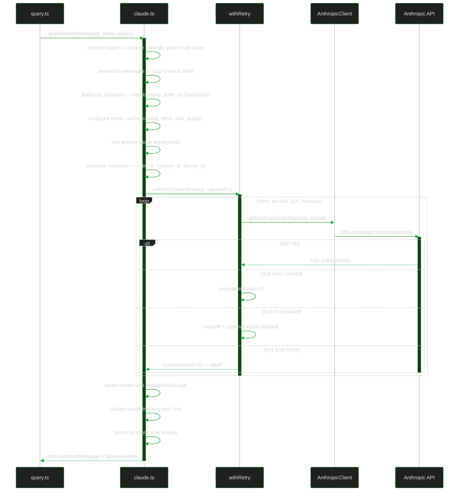
